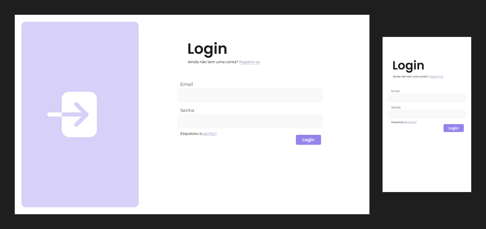
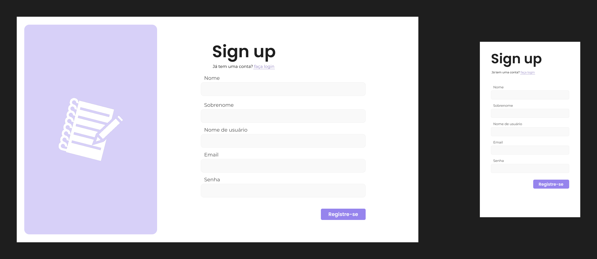
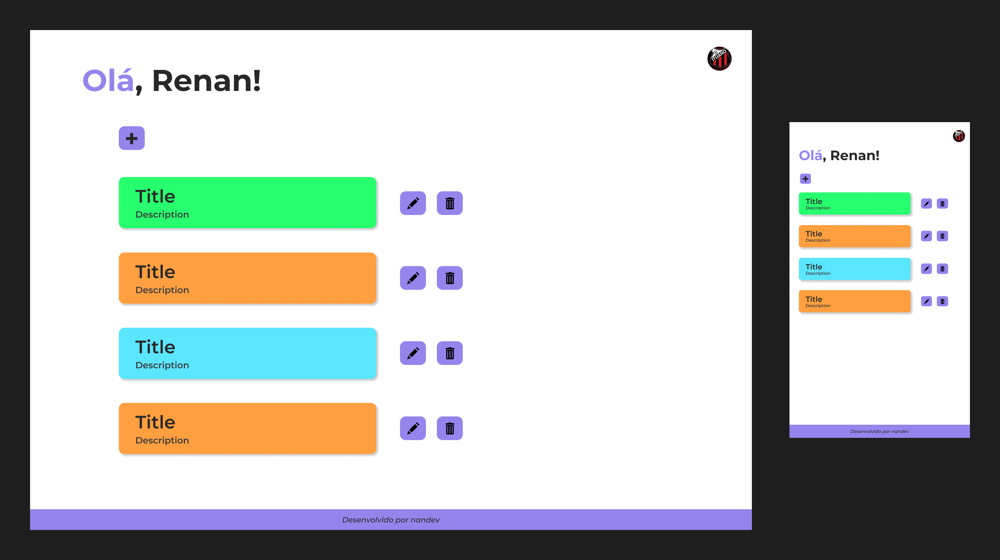

# 📝 EasyList

Um projeto completo de **to-do-list**, desenvolvido com **React + TypeScript** no front-end e **Node.js + Express** no back-end.  
A aplicação conta com autenticação, gerenciamento de tarefas e integração com email para confirmação de login.

---

## 🚀 Tecnologias Utilizadas

### Front-end

- ⚛️ [React](https://react.dev/) + [TypeScript](https://www.typescriptlang.org/)
- 🔗 [React Router](https://reactrouter.com/) (navegação)
- 🔄 [React Query](https://tanstack.com/query/latest) (gerenciamento de estado servidor e cache de requisições)
- ✅ [Zod](https://zod.dev/) (validação de dados)
- 🐻 [Zustand](https://zustand-demo.pmnd.rs/) (gerenciamento de estado global)
- ⚡ [Vite](https://vitejs.dev/) (build e desenvolvimento)
- ✨ ESLint + Prettier (padronização de código)

### Back-end

- 🚀 [Express](https://expressjs.com/) + [TypeScript](https://www.typescriptlang.org/)
- ✅ [Zod](https://zod.dev/) (validação de dados)
- 🗄️ [Prisma](https://www.prisma.io/) (ORM para MySQL)
- 🔑 [Argon2](https://www.npmjs.com/package/argon2) (hash de senhas)
- 🛢️ [PostgreSQL](https://www.postgresql.org/) (banco de dados principal)
- ⚡ [Redis](https://redis.io/) (rate limiting e gerenciamento de sessão)
- 🧪 [Vitest](https://vitest.dev/) (testes unitários)
- ✨ ESLint + Prettier

### Infraestrutura

- 🐳 [Docker](https://www.docker.com/) (conteinerização)
- ⚙️ [GitHub Actions](https://docs.github.com/actions) (CI/CD)
- 📧 [Resend](https://resend.com/) (envio de emails)
- ☁️ [AWS S3](https://aws.amazon.com/pt/pm/serv-s3/?trk=32b96db8-849f-4365-bfe1-053cf18c09ae&sc_channel=ps&ef_id=CjwKCAjwyYPOBhBxEiwAgpT8P0ErLRfZGeiuYi9Gou1xO21owSu4sqo5G-hRpL1s1bxg9vpSQv_S4BoCZJ0QAvD_BwE:G:s&s_kwcid=AL!4422!3!795811760298!e!!g!!aws%20s3!23528573681!194200783593&gad_campaignid=23528573681&gbraid=0AAAAADjHtp_lMiumyisRmqDXiE7LL_HNE&gclid=CjwKCAjwyYPOBhBxEiwAgpT8P0ErLRfZGeiuYi9Gou1xO21owSu4sqo5G-hRpL1s1bxg9vpSQv_S4BoCZJ0QAvD_BwE) (armazenamento de imagens)

### Utilitários

- 📮 [Insomnia](https://insomnia.rest/) (requisições para a API)

---

## ✅ Funcionalidades

- Cadastro e login de usuário
- Envio de emails transacionais (Resend)
- Criação, listagem, edição e exclusão de tarefas
- Autenticação com JWT
- Testes unitários com Vitest
- Pipeline CI/CD automatizado com GitHub Actions

---

## 🎨 Design

As telas do projeto estão disponíveis na pasta [`designs/`](./designs).

### Principais telas

| Login                      | Register                         | Tasks Page                           |
| -------------------------- | -------------------------------- | ------------------------------------ |
|  |  |  |
